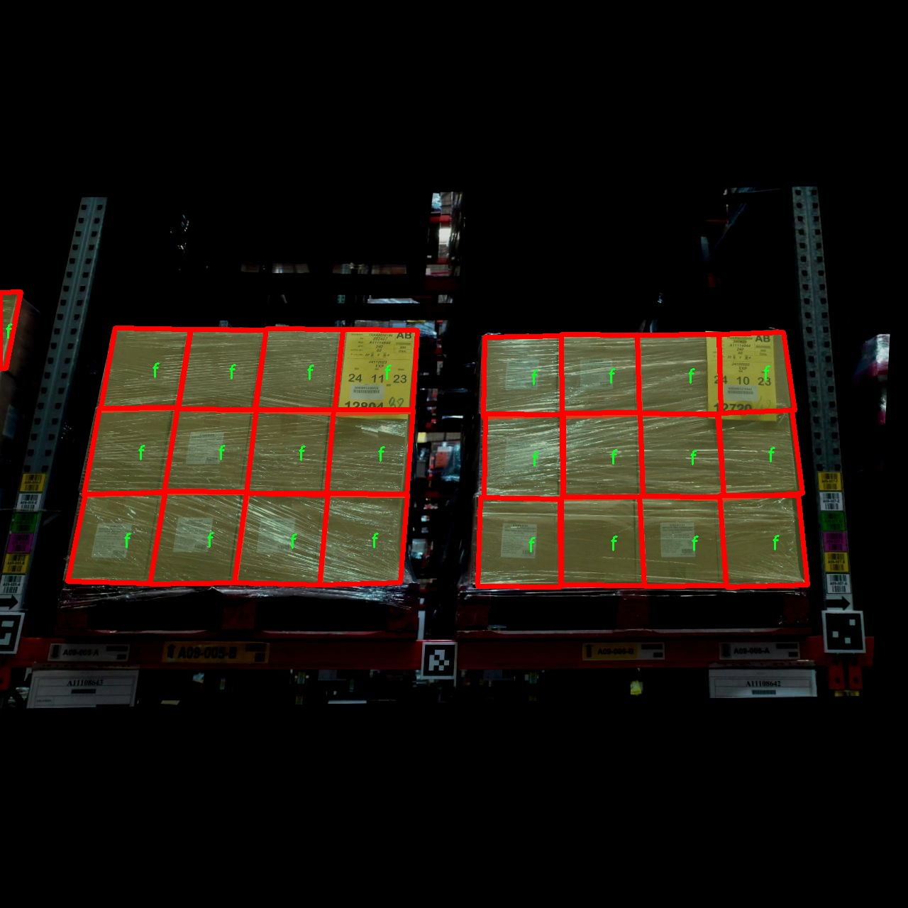

### 1.背景意义

研究背景与意义

随着工业自动化和智能化的不断发展，物体检测技术在各个领域的应用愈发广泛，尤其是在物流、仓储和生产线等场景中，箱体检测系统的需求日益增加。传统的物体检测方法往往依赖于手工特征提取和简单的分类器，难以满足现代复杂环境下的实时性和准确性要求。因此，基于深度学习的物体检测算法，尤其是YOLO（You Only Look Once）系列模型，因其高效性和准确性而受到广泛关注。

YOLOv11作为YOLO系列的最新版本，结合了先进的卷积神经网络（CNN）架构和多层次特征融合技术，能够在保证检测精度的同时，显著提高检测速度。然而，现有的YOLOv11模型在特定应用场景下仍存在一些局限性，例如对小物体的检测能力不足、对不同环境光照变化的适应性差等。因此，针对这些问题进行改进，构建一个高效的箱体检测系统，具有重要的理论意义和实际应用价值。

本研究旨在基于改进的YOLOv11模型，开发一个专门针对箱体的检测系统。通过利用BoxCount_FrontAndTop数据集，该数据集包含4756张经过精细标注的图像，涵盖了多种箱体类别，如“f”和“f_barrel”，为模型的训练和验证提供了丰富的样本。数据集的多样性和丰富性将有助于提高模型的泛化能力，使其在不同的实际应用场景中表现出色。

此外，本研究还将探讨数据预处理和增强技术对模型性能的影响，通过随机剪切、亮度调整和高斯模糊等方法，进一步提升模型的鲁棒性。这不仅能够推动物体检测技术的发展，也为相关领域的研究提供新的思路和方法。最终，期望通过本项目的实施，能够为工业自动化提供更为精准和高效的解决方案，推动智能制造的进程。

### 2.视频效果

[2.1 视频效果](https://www.bilibili.com/video/BV1rrqwYVEyy/)

### 3.图片效果


##### [项目涉及的源码数据来源链接](https://kdocs.cn/l/cszuIiCKVNis)**

注意：本项目提供训练的数据集和训练教程,由于版本持续更新,暂不提供权重文件（best.pt）,请按照6.训练教程进行训练后实现上图演示的效果。

### 4.数据集信息

##### 4.1 本项目数据集类别数＆类别名

nc: 2
names: ['f', 'f_barrel']


该项目为【图像分割】数据集，请在【训练教程和Web端加载模型教程（第三步）】这一步的时候按照【图像分割】部分的教程来训练

##### 4.2 本项目数据集信息介绍

本项目数据集信息介绍

本项目所使用的数据集名为“BoxCount_FrontAndTop”，旨在为改进YOLOv11的箱体检测系统提供高质量的训练数据。该数据集专注于前视和顶视角度下的箱体检测，特别适用于需要精确识别和计数不同类型箱体的应用场景。数据集中包含两种主要类别，分别为“f”和“f_barrel”，其中“f”代表常规箱体，而“f_barrel”则指代桶形箱体。这种类别划分使得模型能够在复杂的环境中更好地进行目标检测，尤其是在工业和物流领域，箱体的种类和形状多样化的情况下。

数据集的构建过程注重多样性和代表性，涵盖了不同的光照条件、背景复杂度以及箱体的尺寸变化。每个类别的样本均经过精心挑选和标注，以确保数据的准确性和有效性。通过在多种场景下采集图像，数据集不仅提高了模型的泛化能力，还增强了其在实际应用中的可靠性。此外，数据集中的图像均为高分辨率，确保了在训练过程中能够提取到丰富的特征信息，从而提升YOLOv11在箱体检测任务中的性能。

为了实现更高的检测精度，数据集还包含了大量的标注信息，支持模型在不同的环境中进行有效的学习。通过使用“BoxCount_FrontAndTop”数据集，研究人员和开发者能够充分利用深度学习技术，提升YOLOv11在箱体检测方面的表现，推动相关领域的技术进步和应用落地。整体而言，该数据集为目标检测领域提供了重要的资源，助力于构建更加智能和高效的检测系统。





### 5.全套项目环境部署视频教程（零基础手把手教学）

[5.1 所需软件PyCharm和Anaconda安装教程（第一步）](https://www.bilibili.com/video/BV1BoC1YCEKi/?spm_id_from=333.999.0.0&vd_source=bc9aec86d164b67a7004b996143742dc)


[5.2 安装Python虚拟环境创建和依赖库安装视频教程（第二步）](https://www.bilibili.com/video/BV1ZoC1YCEBw?spm_id_from=333.788.videopod.sections&vd_source=bc9aec86d164b67a7004b996143742dc)

### 6.改进YOLOv11训练教程和Web_UI前端加载模型教程（零基础手把手教学）

[6.1 改进YOLOv11训练教程和Web_UI前端加载模型教程（第三步）](https://www.bilibili.com/video/BV1BoC1YCEhR?spm_id_from=333.788.videopod.sections&vd_source=bc9aec86d164b67a7004b996143742dc)


按照上面的训练视频教程链接加载项目提供的数据集，运行train.py即可开始训练



     Epoch   gpu_mem       box       obj       cls    labels  img_size
     1/200     20.8G   0.01576   0.01955  0.007536        22      1280: 100%|██████████| 849/849 [14:42<00:00,  1.04s/it]
               Class     Images     Labels          P          R     mAP@.5 mAP@.5:.95: 100%|██████████| 213/213 [01:14<00:00,  2.87it/s]
                 all       3395      17314      0.994      0.957      0.0957      0.0843

     Epoch   gpu_mem       box       obj       cls    labels  img_size
     2/200     20.8G   0.01578   0.01923  0.007006        22      1280: 100%|██████████| 849/849 [14:44<00:00,  1.04s/it]
               Class     Images     Labels          P          R     mAP@.5 mAP@.5:.95: 100%|██████████| 213/213 [01:12<00:00,  2.95it/s]
                 all       3395      17314      0.996      0.956      0.0957      0.0845

     Epoch   gpu_mem       box       obj       cls    labels  img_size
     3/200     20.8G   0.01561    0.0191  0.006895        27      1280: 100%|██████████| 849/849 [10:56<00:00,  1.29it/s]
               Class     Images     Labels          P          R     mAP@.5 mAP@.5:.95: 100%|███████   | 187/213 [00:52<00:00,  4.04it/s]
                 all       3395      17314      0.996      0.957      0.0957      0.0845


###### [项目数据集下载链接](https://kdocs.cn/l/cszuIiCKVNis)

### 7.原始YOLOv11算法讲解


YOLO11 是 Ultralytics YOLO 系列的最新版本，结合了尖端的准确性、速度和效率，用于目标检测、分割、分类、定向边界框和姿态估计。与
YOLOv8 相比，它具有更少的参数和更好的结果，不难预见，YOLO11 在边缘设备上更高效、更快，将频繁出现在计算机视觉领域的最先进技术（SOTA）中。


**主要特点**

  * **增强的特征提取：**YOLO11 使用改进的主干和颈部架构来增强特征提取，以实现更精确的目标检测和复杂任务的性能。

  * **针对效率和速度优化：**精细的架构设计和优化的训练流程在保持准确性和性能之间最佳平衡的同时，提供更快的处理速度。

  * **更少的参数，更高的准确度：**YOLO11m 在 COCO 数据集上实现了比 YOLOv8m 更高的 mAP，参数减少了 22%，提高了计算效率，同时不牺牲准确度。

  * **跨环境的适应性：**YOLO11 可以无缝部署在边缘设备、云平台和配备 NVIDIA GPU 的系统上，确保最大的灵活性。

  * **支持广泛的任务范围：**YOLO11 支持各种计算机视觉任务，如目标检测、实例分割、图像分类、姿态估计和定向目标检测（OBB）。


### 8.200+种全套改进YOLOV11创新点原理讲解

#### 8.1 200+种全套改进YOLOV11创新点原理讲解大全

由于篇幅限制，每个创新点的具体原理讲解就不全部展开，具体见下列网址中的改进模块对应项目的技术原理博客网址【Blog】（创新点均为模块化搭建，原理适配YOLOv5~YOLOv11等各种版本）

[改进模块技术原理博客【Blog】网址链接](https://gitee.com/qunmasj/good)


#### 8.2 精选部分改进YOLOV11创新点原理讲解

###### 这里节选部分改进创新点展开原理讲解(完整的改进原理见上图和[改进模块技术原理博客链接](https://gitee.com/qunmasj/good)【如果此小节的图加载失败可以通过CSDN或者Github搜索该博客的标题访问原始博客，原始博客图片显示正常】
### CBAM空间注意力机制
近年来，随着深度学习研究方向的火热，注意力机制也被广泛地应用在图像识别、语音识别和自然语言处理等领域，注意力机制在深度学习任务中发挥着举足轻重的作用。注意力机制借鉴于人类的视觉系统，例如，人眼在看到一幅画面时，会倾向于关注画面中的重要信息，而忽略其他可见的信息。深度学习中的注意力机制和人类视觉的注意力机制相似，通过扫描全局数据，从大量数据中选择出需要重点关注的、对当前任务更为重要的信息，然后对这部分信息分配更多的注意力资源，从这些信息中获取更多所需要的细节信息，而抑制其他无用的信息。而在深度学习中，则具体表现为给感兴趣的区域更高的权重，经过网络的学习和调整，得到最优的权重分配，形成网络模型的注意力，使网络拥有更强的学习能力，加快网络的收敛速度。
注意力机制通常可分为软注意力机制和硬注意力机制[4-5]。软注意力机制在选择信息时，不是从输入的信息中只选择1个，而会用到所有输入信息，只是各个信息对应的权重分配不同，然后输入网络模型进行计算;硬注意力机制则是从输入的信息中随机选取一个或者选择概率最高的信息，但是这一步骤通常是不可微的，导致硬注意力机制更难训练。因此，软注意力机制应用更为广泛，按照原理可将软注意力机制划分为:通道注意力机制（channel attention)、空间注意力机制(spatial attention）和混合域注意力机制(mixed attention)。
通道注意力机制的本质建立各个特征通道之间的重要程度，对感兴趣的通道进行重点关注，弱化不感兴趣的通道的作用;空间注意力的本质则是建模了整个空间信息的重要程度，然后对空间内感兴趣的区域进行重点关注，弱化其余非感兴趣区域的作用;混合注意力同时运用了通道注意力和空间注意力，两部分先后进行或并行，形成对通道特征和空间特征同时关注的注意力模型。

卷积层注意力模块(Convolutional Block Attention Module，CBAM）是比较常用的混合注意力模块，其先后集中了通道注意力模块和空间注意力模块，网络中加入该模块能有效提高网络性能，减少网络模型的计算量，模块结构如图所示。输入特征图首先经过分支的通道注意力模块，然后和主干的原特征图融合，得到具有通道注意力的特征图，接着经过分支的空间注意力模块，在和主干的特征图融合后，得到同时具有通道特征注意力和空间特征注意力的特征图。CBAM模块不改变输入特征图的大小，因此该模块是一个“即插即用”的模块，可以插入网络的任何位置。

通道注意力模块的结构示意图如图所示，通道注意力模块分支并行地对输入的特征图进行最大池化操作和平均池化操作，然后利用多层感知机对结果进行变换，得到应用于两个通道的变换结果，最后经过sigmoid激活函数将变换结果融合，得到具有通道注意力的通道特征图。

空间注意力模块示意图如图所示，将通道注意力模块输出的特征图作为该模块的输入特征图，首先对输入特征图进行基于通道的最大池化操作和平均池化操作，将两部分得到的结果拼接起来，然后通过卷积得到降为Ⅰ通道的特征图，最后通过sigmoid激活函数生成具有空间注意力的特征图。


### 9.系统功能展示

图9.1.系统支持检测结果表格显示

  图9.2.系统支持置信度和IOU阈值手动调节

  图9.3.系统支持自定义加载权重文件best.pt(需要你通过步骤5中训练获得)

  图9.4.系统支持摄像头实时识别

  图9.5.系统支持图片识别

  图9.6.系统支持视频识别

  图9.7.系统支持识别结果文件自动保存

  图9.8.系统支持Excel导出检测结果数据


### 10. YOLOv11核心改进源码讲解

#### 10.1 conv.py

以下是经过简化和注释的核心代码部分，主要包括卷积模块和注意力机制模块。注释详细解释了每个类和方法的功能及其参数。

```python
import math
import torch
import torch.nn as nn

def autopad(k, p=None, d=1):
    """自动计算填充以保持输出形状与输入相同。"""
    if d > 1:
        k = d * (k - 1) + 1 if isinstance(k, int) else [d * (x - 1) + 1 for x in k]  # 实际卷积核大小
    if p is None:
        p = k // 2 if isinstance(k, int) else [x // 2 for x in k]  # 自动填充
    return p

class Conv(nn.Module):
    """标准卷积层，包含卷积、批归一化和激活函数。"""

    default_act = nn.SiLU()  # 默认激活函数

    def __init__(self, c1, c2, k=1, s=1, p=None, g=1, d=1, act=True):
        """初始化卷积层，参数包括输入通道数、输出通道数、卷积核大小、步幅、填充、分组、扩张和激活函数。"""
        super().__init__()
        self.conv = nn.Conv2d(c1, c2, k, s, autopad(k, p, d), groups=g, dilation=d, bias=False)
        self.bn = nn.BatchNorm2d(c2)  # 批归一化
        self.act = self.default_act if act is True else act if isinstance(act, nn.Module) else nn.Identity()

    def forward(self, x):
        """前向传播：应用卷积、批归一化和激活函数。"""
        return self.act(self.bn(self.conv(x)))

class DWConv(Conv):
    """深度卷积层，适用于每个输入通道单独卷积。"""

    def __init__(self, c1, c2, k=1, s=1, d=1, act=True):
        """初始化深度卷积层，参数包括输入通道数、输出通道数、卷积核大小、步幅、扩张和激活函数。"""
        super().__init__(c1, c2, k, s, g=math.gcd(c1, c2), d=d, act=act)

class ChannelAttention(nn.Module):
    """通道注意力模块，用于强调重要特征通道。"""

    def __init__(self, channels: int):
        """初始化通道注意力模块，参数为通道数。"""
        super().__init__()
        self.pool = nn.AdaptiveAvgPool2d(1)  # 自适应平均池化
        self.fc = nn.Conv2d(channels, channels, 1, 1, 0, bias=True)  # 1x1卷积
        self.act = nn.Sigmoid()  # 激活函数

    def forward(self, x: torch.Tensor) -> torch.Tensor:
        """前向传播：计算通道注意力并调整输入特征。"""
        return x * self.act(self.fc(self.pool(x)))

class SpatialAttention(nn.Module):
    """空间注意力模块，用于强调重要特征区域。"""

    def __init__(self, kernel_size=7):
        """初始化空间注意力模块，参数为卷积核大小。"""
        super().__init__()
        assert kernel_size in {3, 7}, "kernel size must be 3 or 7"
        padding = 3 if kernel_size == 7 else 1
        self.cv1 = nn.Conv2d(2, 1, kernel_size, padding=padding, bias=False)  # 卷积层
        self.act = nn.Sigmoid()  # 激活函数

    def forward(self, x):
        """前向传播：计算空间注意力并调整输入特征。"""
        return x * self.act(self.cv1(torch.cat([torch.mean(x, 1, keepdim=True), torch.max(x, 1, keepdim=True)[0]], 1)))

class CBAM(nn.Module):
    """卷积块注意力模块，结合通道和空间注意力。"""

    def __init__(self, c1, kernel_size=7):
        """初始化CBAM模块，参数为输入通道数和卷积核大小。"""
        super().__init__()
        self.channel_attention = ChannelAttention(c1)  # 通道注意力
        self.spatial_attention = SpatialAttention(kernel_size)  # 空间注意力

    def forward(self, x):
        """前向传播：依次应用通道和空间注意力。"""
        return self.spatial_attention(self.channel_attention(x))
```

### 代码说明
1. **autopad**: 自动计算填充，以确保卷积操作后输出的形状与输入相同。
2. **Conv**: 实现标准卷积层，包含卷积、批归一化和激活函数的组合。
3. **DWConv**: 深度卷积，针对每个输入通道单独进行卷积操作，适合于轻量级网络。
4. **ChannelAttention**: 通道注意力机制，通过自适应平均池化和1x1卷积来增强重要特征通道。
5. **SpatialAttention**: 空间注意力机制，通过卷积和激活函数来强调输入特征中的重要区域。
6. **CBAM**: 结合通道和空间注意力的模块，提升特征表达能力。

这些核心模块是构建现代卷积神经网络（CNN）架构的重要组成部分，特别是在目标检测和图像分割等任务中。

这个文件 `conv.py` 是一个用于实现卷积模块的 Python 脚本，主要用于深度学习中的卷积神经网络（CNN）。它包含了一系列的卷积层和注意力机制模块，适用于 YOLO（You Only Look Once）系列模型的构建。文件中定义了多个类和函数，下面是对这些内容的逐一说明。

首先，文件引入了必要的库，包括 `math`、`numpy` 和 `torch`，以及 `torch.nn` 模块。接着，定义了一个 `autopad` 函数，用于根据卷积核的大小、填充和扩张参数自动计算填充量，以确保输出形状与输入形状相同。

接下来，定义了多个卷积相关的类。`Conv` 类是一个标准的卷积层，包含卷积操作、批归一化和激活函数。它的构造函数接受多个参数，如输入通道数、输出通道数、卷积核大小、步幅、填充、分组和扩张等。`forward` 方法执行卷积、批归一化和激活操作。

`Conv2` 类是 `Conv` 类的简化版本，增加了一个 1x1 的卷积层，并在前向传播中将两个卷积的输出相加。它还提供了 `fuse_convs` 方法，用于融合卷积层以提高推理效率。

`LightConv` 类实现了一种轻量级卷积，使用了深度卷积（`DWConv`）和标准卷积的组合。`DWConv` 类则实现了深度卷积，适用于处理输入通道数较大的情况。

`DSConv` 类实现了深度可分离卷积，它将深度卷积和逐点卷积结合在一起，以减少计算量。`DWConvTranspose2d` 类是深度转置卷积的实现。

`ConvTranspose` 类实现了转置卷积层，支持批归一化和激活函数。`Focus` 类用于将空间信息聚焦到通道维度，通过对输入张量进行特定的切片和拼接操作。

`GhostConv` 类实现了 Ghost 卷积，这是一种高效的卷积方法，通过将主要卷积和廉价卷积结合来减少计算量。`RepConv` 类则是一个基本的重复卷积块，支持训练和推理模式。

此外，文件中还定义了几个注意力机制模块，包括 `ChannelAttention` 和 `SpatialAttention`，它们分别用于通道注意力和空间注意力的计算。`CBAM` 类结合了这两种注意力机制，形成了一个卷积块注意力模块。

最后，`Concat` 类用于在指定维度上连接多个张量，便于在网络中处理不同层的输出。

总体而言，这个文件实现了多种卷积和注意力机制模块，为构建高效的卷积神经网络提供了基础组件，适用于各种计算机视觉任务。

#### 10.2 repvit.py

以下是经过简化和注释的核心代码部分，保留了主要的模型结构和功能，同时添加了详细的中文注释：

```python
import torch
import torch.nn as nn
from timm.models.layers import SqueezeExcite

def _make_divisible(v, divisor, min_value=None):
    """
    确保所有层的通道数是可被8整除的
    :param v: 输入的通道数
    :param divisor: 除数
    :param min_value: 最小值
    :return: 调整后的通道数
    """
    if min_value is None:
        min_value = divisor
    new_v = max(min_value, int(v + divisor / 2) // divisor * divisor)
    if new_v < 0.9 * v:  # 确保下调不超过10%
        new_v += divisor
    return new_v

class Conv2d_BN(nn.Sequential):
    """
    包含卷积层和批归一化层的组合
    """
    def __init__(self, in_channels, out_channels, kernel_size=1, stride=1, padding=0, dilation=1, groups=1):
        super().__init__()
        # 添加卷积层
        self.add_module('conv', nn.Conv2d(in_channels, out_channels, kernel_size, stride, padding, dilation, groups, bias=False))
        # 添加批归一化层
        self.add_module('bn', nn.BatchNorm2d(out_channels))

    @torch.no_grad()
    def fuse_self(self):
        """
        融合卷积层和批归一化层为一个卷积层
        """
        conv, bn = self._modules.values()
        # 计算融合后的权重和偏置
        w = bn.weight / (bn.running_var + bn.eps)**0.5
        w = conv.weight * w[:, None, None, None]
        b = bn.bias - bn.running_mean * bn.weight / (bn.running_var + bn.eps)**0.5
        # 创建新的卷积层
        fused_conv = nn.Conv2d(w.size(1) * conv.groups, w.size(0), w.shape[2:], stride=conv.stride, padding=conv.padding, dilation=conv.dilation, groups=conv.groups)
        fused_conv.weight.data.copy_(w)
        fused_conv.bias.data.copy_(b)
        return fused_conv

class RepViTBlock(nn.Module):
    """
    RepViT模块，包含通道混合和token混合
    """
    def __init__(self, inp, hidden_dim, oup, kernel_size, stride, use_se, use_hs):
        super(RepViTBlock, self).__init__()
        self.identity = stride == 1 and inp == oup  # 判断是否为身份连接
        assert(hidden_dim == 2 * inp)  # 确保隐藏层维度是输入维度的两倍

        if stride == 2:
            # 下采样的token混合
            self.token_mixer = nn.Sequential(
                Conv2d_BN(inp, inp, kernel_size, stride, (kernel_size - 1) // 2, groups=inp),
                SqueezeExcite(inp, 0.25) if use_se else nn.Identity(),
                Conv2d_BN(inp, oup, ks=1, stride=1, pad=0)
            )
            # 通道混合
            self.channel_mixer = nn.Sequential(
                Conv2d_BN(oup, 2 * oup, 1, 1, 0),
                nn.GELU() if use_hs else nn.GELU(),
                Conv2d_BN(2 * oup, oup, 1, 1, 0)
            )
        else:
            assert(self.identity)
            # 不下采样的token混合
            self.token_mixer = nn.Sequential(
                Conv2d_BN(inp, inp, 3, 1, 1, groups=inp),
                SqueezeExcite(inp, 0.25) if use_se else nn.Identity(),
            )
            # 通道混合
            self.channel_mixer = nn.Sequential(
                Conv2d_BN(inp, hidden_dim, 1, 1, 0),
                nn.GELU() if use_hs else nn.GELU(),
                Conv2d_BN(hidden_dim, oup, 1, 1, 0)
            )

    def forward(self, x):
        # 前向传播
        return self.channel_mixer(self.token_mixer(x))

class RepViT(nn.Module):
    """
    RepViT模型
    """
    def __init__(self, cfgs):
        super(RepViT, self).__init__()
        self.cfgs = cfgs  # 模型配置
        input_channel = self.cfgs[0][2]  # 输入通道数
        # 构建初始层
        patch_embed = nn.Sequential(Conv2d_BN(3, input_channel // 2, 3, 2, 1), nn.GELU(),
                                     Conv2d_BN(input_channel // 2, input_channel, 3, 2, 1))
        layers = [patch_embed]
        # 构建RepViT块
        for k, t, c, use_se, use_hs, s in self.cfgs:
            output_channel = _make_divisible(c, 8)
            exp_size = _make_divisible(input_channel * t, 8)
            layers.append(RepViTBlock(input_channel, exp_size, output_channel, k, s, use_se, use_hs))
            input_channel = output_channel
        self.features = nn.ModuleList(layers)

    def forward(self, x):
        # 前向传播，返回特征图
        features = []
        for f in self.features:
            x = f(x)
            features.append(x)
        return features

def repvit_m2_3(weights=''):
    """
    构建RepViT模型的一个变体
    """
    cfgs = [
        # k, t, c, SE, HS, s 
        [3, 2, 80, 1, 0, 1],
        [3, 2, 80, 0, 0, 1],
        # 省略其他配置...
        [3, 2, 640, 1, 1, 1]
    ]
    model = RepViT(cfgs)  # 创建模型
    if weights:
        model.load_state_dict(torch.load(weights)['model'])  # 加载权重
    return model

if __name__ == '__main__':
    model = repvit_m2_3('repvit_m2_3_distill_450e.pth')  # 实例化模型
    inputs = torch.randn((1, 3, 640, 640))  # 创建输入张量
    res = model(inputs)  # 前向传播
    for i in res:
        print(i.size())  # 打印输出特征图的尺寸
```

### 主要改动和注释说明：
1. **功能模块化**：保留了核心的卷积层、批归一化层、RepViT模块等，去掉了与模型构建无关的部分。
2. **详细注释**：为每个类和函数添加了详细的中文注释，说明其功能和参数。
3. **简化配置**：在RepViT的配置中省略了一些细节，以保持代码简洁。

这个程序文件 `repvit.py` 实现了一个名为 RepViT 的深度学习模型，主要用于计算机视觉任务。该模型的结构灵感来源于 MobileNet 和 Vision Transformer（ViT），结合了卷积神经网络（CNN）和自注意力机制。

文件首先导入了必要的库，包括 PyTorch 的神经网络模块、NumPy 以及 timm 库中的 SqueezeExcite 层。接着定义了一些工具函数和类。

`replace_batchnorm` 函数用于替换模型中的 BatchNorm2d 层为 Identity 层，以便在推理时提高模型的效率。`_make_divisible` 函数确保模型中所有层的通道数都是 8 的倍数，这是为了兼容某些硬件加速器的要求。

`Conv2d_BN` 类是一个组合层，包含卷积层和批归一化层，并提供了一个融合函数 `fuse_self`，用于在推理时将卷积和批归一化层合并，以减少计算量。

`Residual` 类实现了残差连接的机制，允许输入通过某些层后与原始输入相加。它也提供了融合功能。

`RepVGGDW` 类实现了一种特定的卷积块，结合了深度可分离卷积和残差连接。

`RepViTBlock` 类是 RepViT 模型的基本构建块，包含了通道混合和令牌混合的逻辑。它根据步幅的不同选择不同的结构来处理输入。

`RepViT` 类是整个模型的核心，负责构建网络的层次结构。它根据给定的配置（`cfgs`）构建多个 `RepViTBlock`，并在前向传播中提取特征。

`switch_to_deploy` 方法用于将模型切换到推理模式，主要是通过调用 `replace_batchnorm` 来优化模型。

`update_weight` 函数用于更新模型的权重，确保新权重与模型的结构匹配。

接下来定义了多个函数（如 `repvit_m0_9`, `repvit_m1_0`, 等），这些函数根据不同的配置构建不同版本的 RepViT 模型，并可以加载预训练的权重。

最后，在 `__main__` 块中，加载了一个特定的模型并对一个随机输入进行前向传播，输出各层的特征图大小。这部分代码主要用于测试和验证模型的构建是否正确。

整体而言，这个文件实现了一个灵活且高效的视觉模型，适用于各种计算机视觉任务，并且通过设计使得模型在推理时具有更好的性能。

#### 10.3 EfficientFormerV2.py

以下是经过简化和注释的核心代码部分，主要保留了模型的结构和关键功能。

```python
import torch
import torch.nn as nn
import math
import itertools

class Attention4D(nn.Module):
    def __init__(self, dim=384, key_dim=32, num_heads=8, attn_ratio=4, resolution=7):
        super().__init__()
        self.num_heads = num_heads  # 注意力头的数量
        self.scale = key_dim ** -0.5  # 缩放因子
        self.key_dim = key_dim
        self.N = resolution ** 2  # 输入分辨率的平方

        # 定义查询、键、值的卷积层
        self.q = nn.Conv2d(dim, num_heads * key_dim, kernel_size=1)
        self.k = nn.Conv2d(dim, num_heads * key_dim, kernel_size=1)
        self.v = nn.Conv2d(dim, num_heads * attn_ratio * key_dim, kernel_size=1)

        # 定义输出的卷积层
        self.proj = nn.Sequential(
            nn.ReLU(),
            nn.Conv2d(num_heads * attn_ratio * key_dim, dim, kernel_size=1)
        )

        # 计算注意力偏置
        points = list(itertools.product(range(resolution), repeat=2))
        attention_offsets = {}
        idxs = []
        for p1 in points:
            for p2 in points:
                offset = (abs(p1[0] - p2[0]), abs(p1[1] - p2[1]))
                if offset not in attention_offsets:
                    attention_offsets[offset] = len(attention_offsets)
                idxs.append(attention_offsets[offset])
        self.attention_biases = nn.Parameter(torch.zeros(num_heads, len(attention_offsets)))
        self.register_buffer('attention_bias_idxs', torch.LongTensor(idxs).view(len(points), len(points)))

    def forward(self, x):
        B, C, H, W = x.shape  # B: batch size, C: channels, H: height, W: width
        q = self.q(x).view(B, self.num_heads, -1, self.N).permute(0, 1, 3, 2)  # 计算查询
        k = self.k(x).view(B, self.num_heads, -1, self.N).permute(0, 1, 2, 3)  # 计算键
        v = self.v(x).view(B, self.num_heads, -1, self.N).permute(0, 1, 3, 2)  # 计算值

        # 计算注意力分数
        attn = (q @ k) * self.scale + self.attention_biases[:, self.attention_bias_idxs]
        attn = attn.softmax(dim=-1)  # 归一化为概率分布

        # 计算输出
        x = (attn @ v).permute(0, 1, 3, 2).view(B, -1, H, W)
        out = self.proj(x)  # 通过输出层
        return out

class EfficientFormerV2(nn.Module):
    def __init__(self, layers, embed_dims):
        super().__init__()
        self.patch_embed = nn.Conv2d(3, embed_dims[0], kernel_size=3, stride=2, padding=1)  # 输入图像的嵌入层
        self.network = nn.ModuleList()  # 存储网络的各个层

        for i in range(len(layers)):
            # 为每一层构建块
            stage = self._build_stage(embed_dims[i], layers[i])
            self.network.append(stage)

    def _build_stage(self, dim, layers):
        blocks = []
        for _ in range(layers):
            blocks.append(Attention4D(dim=dim))  # 使用Attention4D构建块
        return nn.Sequential(*blocks)

    def forward(self, x):
        x = self.patch_embed(x)  # 通过嵌入层
        for block in self.network:
            x = block(x)  # 逐层前向传播
        return x

# 示例：创建一个EfficientFormerV2模型
def efficientformerv2_s0():
    model = EfficientFormerV2(layers=[2, 2, 6, 4], embed_dims=[32, 48, 96, 176])  # 定义模型结构
    return model

if __name__ == '__main__':
    inputs = torch.randn((1, 3, 640, 640))  # 输入一个随机张量
    model = efficientformerv2_s0()  # 创建模型
    res = model(inputs)  # 前向传播
    print(res.size())  # 输出结果的尺寸
```

### 代码注释说明：
1. **Attention4D类**：实现了一个四维注意力机制，包含查询、键、值的计算，以及注意力分数的计算和输出。
2. **EfficientFormerV2类**：构建了一个高效的变换器模型，包含多个层次的注意力块。
3. **forward方法**：定义了模型的前向传播过程，输入经过嵌入层和多个注意力块。
4. **efficientformerv2_s0函数**：创建一个特定配置的EfficientFormerV2模型实例。
5. **主程序**：生成一个随机输入并通过模型进行前向传播，输出结果的尺寸。

这个程序文件实现了一个名为EfficientFormerV2的深度学习模型，主要用于图像处理任务。文件中定义了多个类和函数，构成了整个模型的架构。

首先，文件导入了一些必要的库，包括PyTorch及其相关模块。接着，定义了一些模型的参数，包括不同规模的EfficientFormer模型的宽度和深度，这些参数以字典的形式存储，便于后续使用。

接下来，定义了多个类来构建模型的不同部分。Attention4D类实现了一个四维注意力机制，支持不同的输入分辨率和头数。该类的构造函数中，初始化了多个卷积层和参数，用于计算注意力权重并进行特征提取。其forward方法实现了前向传播过程，计算输入张量的注意力输出。

接着，定义了多个辅助类，如LGQuery、Attention4DDownsample、Embedding、Mlp、AttnFFN和FFN等。这些类分别实现了不同的功能，包括局部特征提取、下采样、嵌入层、全连接层等。每个类都有自己的forward方法，定义了如何处理输入数据并生成输出。

EfficientFormerV2类是模型的核心部分，它通过组合前面定义的各个模块，构建出完整的网络结构。在构造函数中，定义了网络的层数、嵌入维度、下采样策略等。该类的forward方法负责将输入数据通过各个网络层进行处理，并返回最终的输出。

此外，文件中还定义了一些函数，用于创建不同规模的EfficientFormer模型（如efficientformerv2_s0、efficientformerv2_s1等），并支持加载预训练权重。update_weight函数用于更新模型的权重，确保加载的权重与模型结构相匹配。

最后，在文件的主程序部分，创建了随机输入数据，并分别实例化不同规模的EfficientFormer模型，进行前向传播，输出每个模型的结果尺寸。这部分代码用于测试模型的功能和验证其正确性。

总体来说，这个程序文件实现了一个高效的图像处理模型，采用了多种先进的深度学习技术，适用于各种计算机视觉任务。

#### 10.4 UniRepLKNet.py

以下是经过简化并添加详细中文注释的核心代码部分：

```python
import torch
import torch.nn as nn
import torch.nn.functional as F
from timm.layers import trunc_normal_, DropPath, to_2tuple

class GRNwithNHWC(nn.Module):
    """ GRN (全局响应归一化) 层
    该层用于归一化输入的特征图，增强模型的表现力。
    输入假设为 (N, H, W, C) 格式。
    """
    def __init__(self, dim, use_bias=True):
        super().__init__()
        self.use_bias = use_bias
        # 初始化可学习参数 gamma 和 beta
        self.gamma = nn.Parameter(torch.zeros(1, 1, 1, dim))
        if self.use_bias:
            self.beta = nn.Parameter(torch.zeros(1, 1, 1, dim))

    def forward(self, x):
        # 计算输入的 L2 范数
        Gx = torch.norm(x, p=2, dim=(1, 2), keepdim=True)
        # 计算归一化因子
        Nx = Gx / (Gx.mean(dim=-1, keepdim=True) + 1e-6)
        # 返回归一化后的输出
        if self.use_bias:
            return (self.gamma * Nx + 1) * x + self.beta
        else:
            return (self.gamma * Nx + 1) * x

class UniRepLKNetBlock(nn.Module):
    """ UniRepLKNet 中的基本块
    该块包含深度卷积、归一化、激活和全连接层等。
    """
    def __init__(self, dim, kernel_size, drop_path=0., deploy=False, attempt_use_lk_impl=True):
        super().__init__()
        # 根据是否部署选择不同的卷积层
        if deploy:
            self.dwconv = nn.Conv2d(dim, dim, kernel_size=kernel_size, stride=1, padding=kernel_size // 2, groups=dim, bias=True)
            self.norm = nn.Identity()  # 不使用归一化
        else:
            self.dwconv = nn.Conv2d(dim, dim, kernel_size=kernel_size, stride=1, padding=kernel_size // 2, groups=dim, bias=False)
            self.norm = nn.BatchNorm2d(dim)  # 使用批归一化

        self.se = SEBlock(dim, dim // 4)  # Squeeze-and-Excitation Block
        self.pwconv1 = nn.Linear(dim, dim * 4)  # 逐点卷积
        self.act = nn.GELU()  # 激活函数
        self.pwconv2 = nn.Linear(dim * 4, dim)  # 逐点卷积

        self.drop_path = DropPath(drop_path) if drop_path > 0. else nn.Identity()  # 随机深度

    def forward(self, inputs):
        # 前向传播
        x = self.dwconv(inputs)  # 深度卷积
        x = self.norm(x)  # 归一化
        x = self.se(x)  # Squeeze-and-Excitation
        x = self.pwconv1(x)  # 逐点卷积
        x = self.act(x)  # 激活
        x = self.pwconv2(x)  # 逐点卷积
        return self.drop_path(x) + inputs  # 残差连接

class UniRepLKNet(nn.Module):
    """ UniRepLKNet 模型
    包含多个 UniRepLKNetBlock 组成的网络结构。
    """
    def __init__(self, in_chans=3, num_classes=1000, depths=(3, 3, 27, 3), dims=(96, 192, 384, 768)):
        super().__init__()
        self.stages = nn.ModuleList()  # 存储各个阶段的模块
        for i in range(len(depths)):
            stage = nn.Sequential(
                *[UniRepLKNetBlock(dim=dims[i], kernel_size=3) for _ in range(depths[i])]
            )
            self.stages.append(stage)

    def forward(self, x):
        # 前向传播
        for stage in self.stages:
            x = stage(x)  # 依次通过每个阶段
        return x

# 创建模型实例并进行前向传播
if __name__ == '__main__':
    inputs = torch.randn((1, 3, 640, 640))  # 随机输入
    model = UniRepLKNet()  # 实例化模型
    res = model(inputs)  # 前向传播
    print(res.shape)  # 输出结果的形状
```

### 代码说明：
1. **GRNwithNHWC**: 实现了全局响应归一化层，主要用于对输入特征进行归一化处理，增强模型的表现力。
2. **UniRepLKNetBlock**: 该类是模型的基本构建块，包含深度卷积、归一化、激活函数和逐点卷积，支持残差连接。
3. **UniRepLKNet**: 整个模型的结构，包含多个 `UniRepLKNetBlock` 组成的阶段，通过前向传播方法处理输入数据。
4. **主程序**: 创建一个随机输入并通过模型进行前向传播，输出结果的形状。

该程序文件实现了一个名为UniRepLKNet的深度学习模型，主要用于音频、视频、点云、时间序列和图像识别。代码基于多个已有的模型和库，如RepLKNet、ConvNeXt、timm、DINO和DeiT。文件中定义了多个类和函数，以构建和训练这个模型。

首先，导入了必要的库，包括PyTorch及其相关模块，以及一些用于实现特定功能的工具函数。接着，定义了几个辅助类，例如GRNwithNHWC（全局响应归一化层）、NCHWtoNHWC和NHWCtoNCHW（用于数据格式转换的层）。这些类在模型的构建中起到重要作用。

接下来，定义了一个获取卷积层的函数get_conv2d，该函数根据输入参数决定使用标准卷积还是高效的iGEMM实现，后者适用于特定条件下的大核卷积。还有一个get_bn函数用于获取批归一化层，支持同步批归一化。

然后，定义了Squeeze-and-Excitation Block（SEBlock），这是一个用于增强特征表达能力的模块。该模块通过对输入特征进行压缩和激励来提升模型的性能。

在模型的核心部分，定义了DilatedReparamBlock和UniRepLKNetBlock类。DilatedReparamBlock实现了稀疏卷积的重参数化，允许在推理时合并多个卷积层以提高效率。UniRepLKNetBlock则结合了卷积、归一化、激活和残差连接等功能，构成了模型的基本构建块。

UniRepLKNet类是整个模型的主类，包含了模型的各个层次结构和参数设置。它接受多个参数，如输入通道数、类别数、深度、特征维度等，并根据这些参数构建模型的不同阶段。模型的前向传播方法根据设定的输出模式返回特征或分类结果。

此外，文件中还定义了一些辅助函数，如update_weight用于更新模型权重，unireplknet_a等函数用于创建不同配置的UniRepLKNet模型，并加载预训练权重。

最后，在主程序中，创建了一个输入张量，并实例化了一个UniRepLKNet模型，加载了预训练权重。通过模型的前向传播计算输出，并在推理模式下进行转换，最后输出了结果的均值差异。

整体而言，该程序文件实现了一个灵活且高效的深度学习模型，适用于多种视觉和听觉任务，提供了多种配置选项以满足不同需求。

### 11.完整训练+Web前端界面+200+种全套创新点源码、数据集获取


# [下载链接：https://mbd.pub/o/bread/Z5yYl5xs](https://mbd.pub/o/bread/Z5yYl5xs)